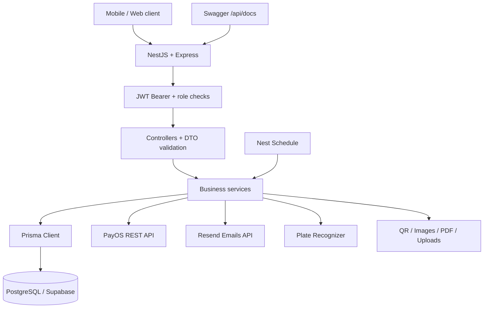

<div align="center">


# 🅿️ PRM393 · Parking Management Backend

**Backend quản lý bãi đỗ xe · NestJS REST API · PostgreSQL · Tích hợp dịch vụ**


**[API hosted](#-api-hosted) · [Tech stack](#-tech-stack) · [Kiến trúc](#-kiến-trúc) · [Chạy local](#-chạy-local) · [Tài liệu](#-tài-liệu)**

</div>

---

## ✨ Dự án làm gì?

API backend cho hệ thống **PRM393 Parking**: tài khoản, phân quyền, danh mục bãi đỗ, đặt chỗ, check-in/check-out, gói gửi xe, thanh toán, sự cố và báo cáo. Dữ liệu đi qua **Prisma 6** tới **PostgreSQL** (Supabase khi host). Swagger là giao diện gửi request đến chính backend.

Hợp đồng HTTP công khai chỉ là **`/api/*`**. Đăng nhập **`POST /api/Auth/login`** (JWT Bearer). Hồ sơ **`GET /api/profile`**. Không còn surface Nest **`/auth/*`** (ví dụ `/auth/login` trả 404).

Phiên bản khai báo nằm trong [package.json](package.json); phiên bản cài đặt được khóa trong [package-lock.json](package-lock.json).

| 🔐 Identity | 🚘 Parking | 💳 Payments | 📊 Operations |
|---|---|---|---|
| JWT Bearer, roles, OTP email (Resend) | Đặt chỗ, phiên gửi xe, QR, OCR biển số | PayOS + webhook | Báo cáo PDF, sự cố, cron |

## 🌐 API hosted

Ứng dụng chạy trên **Render**; database trên **Supabase PostgreSQL**. Origin API **không** gắn path `/api/docs`.

| | URL |
|---|---|
| Origin | [https://prm393-backend-u2ym.onrender.com](https://prm393-backend-u2ym.onrender.com) |
| Swagger UI | [https://prm393-backend-u2ym.onrender.com/api/docs](https://prm393-backend-u2ym.onrender.com/api/docs) |
| Health (keep-alive / liveness) | `GET` [https://prm393-backend-u2ym.onrender.com/health](https://prm393-backend-u2ym.onrender.com/health) |
| Đăng nhập | `POST /api/Auth/login` trên origin ở trên |

Domain **`neoforcelab.com`** dùng cho **email OTP** (`MAIL_FROM` = `otp@neoforcelab.com` sau khi DNS verify trên Resend). Có thể dùng sau cho web/API subdomain, nhưng **chưa** phải host API hiện tại — API vẫn là `*.onrender.com` trừ khi đội tự gắn custom domain trên Render.

Gói Render free **có thể ngủ khi idle** và cold start khi có request. UptimeRobot ping `/health` để giảm sleep, **không** phải cam kết 24/7 hay SLA.

## 🧰 Tech stack

### Core & API

| Công nghệ | Phiên bản khai báo | Vai trò |
|---|---|---|
| Node.js | Runtime; hướng dẫn deploy dùng Node 22 | Chạy backend, native `fetch`, crypto, filesystem |
| TypeScript | `^6.0.2` | Strict mode, NodeNext, target ES2023 |
| NestJS | `^12.0.1` | Module, controller, service, DI |
| Express adapter | `@nestjs/platform-express ^12.0.1` | HTTP, upload, static assets |
| Swagger / OpenAPI | `@nestjs/swagger ^12.0.1` | Docs và thử API tại `/api/docs` |
| class-validator / class-transformer | `^0.15.1` / `^0.5.1` | Validate và transform DTO |
| RxJS · reflect-metadata | `^7.8.1` · `^0.2.2` | Interceptor Nest và decorator metadata |

### Data & authentication

| Công nghệ | Phiên bản khai báo | Vai trò |
|---|---|---|
| PostgreSQL | Do môi trường (local hoặc Supabase) | UUID, index, foreign key |
| Prisma CLI + Client | `6.4.1` | Schema, migration, query có kiểu |
| Passport + Nest Passport + passport-jwt | `^0.7.0` / `^12.0.0` / `^4.0.1` | Strategy JWT |
| Nest JWT | `^12.0.1` | Access / refresh token |
| bcrypt | `^6.0.0` | Hash mật khẩu và refresh token |
| Nest Config | `^12.0.0` | Biến môi trường |

### Tích hợp & nghiệp vụ

| Thành phần | Công nghệ | Cách dùng |
|---|---|---|
| Thanh toán | PayOS REST API + `fetch` + Node crypto | Tạo/tra cứu thanh toán, chữ ký webhook; không có PayOS SDK trong dependencies |
| Email / OTP | **Resend** (`resend` `^6.28.1`) HTTPS | OTP HTML qua `RESEND_API_KEY` và `MAIL_FROM` — **không** Gmail SMTP |
| OCR biển số | Plate Recognizer Snapshot API | Upload ảnh, đọc kết quả nhận diện |
| QR | qrcode `^1.5.4`, jsQR `^1.4.0` | Sinh / đọc QR |
| Ảnh | sharp `^0.34.4` | Xử lý ảnh |
| Báo cáo | PDFKit `^0.17.2` | Xuất PDF |
| Job định kỳ | Nest Schedule `^12.0.0` | Cron reservation |
| File | Filesystem + Express static | Upload theo `UPLOAD_DIR` |

### Tooling, testing & hosting

| Nhóm | Công cụ |
|---|---|
| Tests | Jest `^30.0.0`, ts-jest, `@nestjs/testing`, Supertest |
| Lint / format | Oxlint `^1.58.0`, Prettier `^3.4.2` |
| Build | Nest CLI, ts-node, ts-loader, tsconfig-paths |
| Package | npm + `package-lock.json` |
| Hosting được hướng dẫn | **Render** Web Service + **Supabase** PostgreSQL |
| CORS mặc định | `http://localhost:5173` (`CORS_ORIGIN`) |
| Quản trị DB | pgAdmin 4 hoặc client PostgreSQL tương đương (không phải dependency app) |

<details>
<summary><strong>🔎 Ghi chú dependencies / CI</strong></summary>

- `@nestjs/observe`: đã khai báo; bootstrap chưa cấu hình observability riêng.
- `@nestjs/mau` và `npm run deploy`: có trong starter; quy trình Render dùng build/start riêng.
- Không có workflow CI trong `.github/workflows` lúc cập nhật README. Badge mô tả stack, không chứng nhận CI hay uptime.
- `@prisma/client` đang ở **devDependencies**. Build/deploy giữ `--include=dev` để runtime còn Prisma Client.

</details>

## 🏗️ Kiến trúc



Route `@Public()` không cần access token. Các route còn lại đi qua global JWT guard. Quyền nghiệp vụ áp dụng theo controller/guard tương ứng.

## 🧩 Module

| Thư mục | Phạm vi |
|---|---|
| [`src/auth`](src/auth) | Auth PBMS **`/api/Auth`** (login, OTP, refresh, logout), JWT, mail Resend, guards |
| [`src/users`](src/users) · [`src/roles`](src/roles) | Người dùng, hồ sơ `/api/profile`, vai trò |
| [`src/catalog`](src/catalog) | Loại xe, tầng, cổng, chỗ đỗ, bảng giá, gói gửi xe |
| [`src/reservations`](src/reservations) | Đặt chỗ và cron trạng thái |
| [`src/parking`](src/parking) | Hoạt động bãi xe, phiên gửi xe, OCR |
| [`src/subscriptions`](src/subscriptions) | Gói tháng, gia hạn, đổi xe |
| [`src/payments`](src/payments) | Thanh toán PayOS và webhook |
| [`src/incidents`](src/incidents) | Sự cố |
| [`src/reports`](src/reports) | Báo cáo PDF |
| [`src/integrations`](src/integrations) | PayOS, Plate Recognizer, file storage |
| [`src/prisma`](src/prisma) · [`prisma`](prisma) | Prisma, schema, migration |
| [`src/common`](src/common) | DTO chung, interceptor, QR, biển số |

## 🚀 Chạy local

Cần Node.js phù hợp (hướng dẫn repo: **Node 22**), npm, và PostgreSQL development. Chạy từ **root repo**.

```bash
npm ci --include=dev
```

Tạo `.env` từ [.env.example](.env.example) nếu chưa có. Điền Supabase **Session Pooler URL** (`sslmode=require`) và **hai** JWT secret riêng — xem [hướng dẫn ENV & deploy](docs/huong-dan-env-va-deploy.md). Không commit URL database hay password.

```bash
npx --no-install prisma generate
```

Database **development mới, trống**, migration đã review:

```bash
npx --no-install prisma migrate deploy
npm run start:dev
```

Database đã có bảng/dữ liệu: kiểm tra lịch sử migration trước khi deploy. Không dùng reset/seed thay cho kiểm tra schema. Migration tạo cấu trúc; dữ liệu vận hành nhập qua API hoặc import.

| URL local mặc định | Mục đích |
|---|---|
| `http://localhost:3000/` | Redirect 302 → Swagger |
| `http://localhost:3000/api/docs` | Swagger UI |
| `http://localhost:3000/health` | Liveness HTTP (`{"status":"ok"}`), **không** kiểm tra DB |
| `http://localhost:3000/api/Auth/login` | Đăng nhập JWT (không dùng `/auth/login`) |
| `http://localhost:3000/api/Auth/*` | OTP đăng ký/reset, refresh, logout |
| `http://localhost:3000/api/*` | API nghiệp vụ — danh sách path trong Swagger |

### Biến môi trường (chỉ tên — không dán secret)

| Nhóm | Biến |
|---|---|
| Database | `DATABASE_URL` |
| JWT | `JWT_ACCESS_SECRET`, `JWT_REFRESH_SECRET` |
| Server | `NODE_ENV`, `PORT`, `CORS_ORIGIN`, `PUBLIC_API_URL` |
| PayOS | `PAYOS_CLIENT_ID`, `PAYOS_API_KEY`, `PAYOS_CHECKSUM_KEY`, `PAYOS_RETURN_URL`, `PAYOS_CANCEL_URL` |
| Email / Resend | `RESEND_API_KEY`, `MAIL_FROM`, `MAIL_SENDER_NAME`, `MAIL_REPLY_TO`, `MAIL_BRAND_COLOR` |
| OCR | `PLATE_RECOGNIZER_API_KEY`, `PLATE_RECOGNIZER_ENDPOINT`, `PLATE_RECOGNIZER_REGIONS`, `PLATE_RECOGNIZER_MINIMUM_CONFIDENCE` |
| Files | `UPLOAD_DIR` |

`CORS_ORIGIN` mặc định **`http://localhost:5173`**. `PUBLIC_API_URL` tùy chọn: hiện trên dropdown Servers của Swagger; để trống = cùng origin với trang `/api/docs`. `MAIL_FROM` production: **`otp@neoforcelab.com`** sau khi domain Verified trên Resend.

Giữ secret trong `.env` hoặc Environment hosting. Không commit credential. Email, thanh toán và OCR chỉ kiểm chứng được khi đã có tài khoản nhà cung cấp thật.

## 🧪 Lệnh development

```bash
npm start                 # Chạy Nest
npm run start:dev         # Watch mode
npm run start:debug       # Debug + watch
npm run build             # Biên dịch TypeScript
npm run start:prod        # Chạy bản build
npm run lint              # Oxlint
npm run format            # Prettier trên src/ và test/
npm test -- --runInBand    # Jest
npm run test:cov          # Coverage
```

Smoke HTTP (root, Swagger, health, guard) với Jest chính:

```bash
node --experimental-vm-modules ./node_modules/jest/bin/jest.js --config ./jest.config.ts --testRegex 'app.e2e-spec.ts$' --runInBand
```

`npm run test:e2e` dùng `test/jest-e2e.json`. Test mock **không** chứng minh dịch vụ hosted đã chạy; cần kiểm chứng luồng thật trên môi trường phù hợp.

## ☁️ Deployment

Render chạy backend và Swagger **cùng một** Web Service. Supabase PostgreSQL kết nối qua `DATABASE_URL` (Session Pooler).

| Cấu hình Web Service | Giá trị |
|---|---|
| Build | `npm ci --include=dev && npx --no-install prisma generate && npm run build` |
| Pre-deploy (khi gói hỗ trợ và migration đã review) | `npx --no-install prisma migrate deploy` |
| Start | `npm run start:prod` |
| Health Check Path | `/health` |
| Database | Supabase Session Pooler, `schema=public&sslmode=require` |

Chi tiết: [ENV & deploy](docs/huong-dan-env-va-deploy.md), [health check](docs/render-health-check.md), [uptime Render](docs/render-uptime.md). Không chạy `migrate dev`, reset hay seed tự động lúc startup production.

<details>
<summary><strong>📌 Phạm vi vận hành hiện tại</strong></summary>

- OTP lưu **in-memory** theo process: mất khi restart, không chia sẻ nhiều instance.
- OTP đăng ký/reset gửi HTML qua **Resend**; cần `RESEND_API_KEY` + `MAIL_FROM` và inbox thật sau deploy. Xem [Resend setup](docs/resend-setup.md).
- Upload filesystem: cần disk bền nếu muốn giữ file sau redeploy (Render free thường không có).
- Cron chạy trong process app; nhiều instance cần đánh giá điều phối.
- `GET /health` chỉ liveness HTTP. Kiểm tra DB bằng API và bản ghi thật.
- Có code tích hợp ≠ đã cấu hình tài khoản, webhook và mạng trên hosting.
- Một số file trong `docs/` là snapshot/kế hoạch cũ. Khi lệch, lấy source, schema và migration hiện tại làm chuẩn.

</details>

## 📚 Tài liệu

| Tài liệu | Nội dung |
|---|---|
| [ENV & deployment](docs/huong-dan-env-va-deploy.md) | Credential, host API/DB, kiểm chứng dữ liệu |
| [Resend setup](docs/resend-setup.md) | OTP Resend HTTPS, `otp@neoforcelab.com`, DNS verify |
| [Render health check](docs/render-health-check.md) | Redirect gốc, Swagger, `/health` |
| [Render uptime & UptimeRobot](docs/render-uptime.md) | Sleep khi idle, cold start, monitor `/health` |
| [PBMS API paths](docs/openapi-pbms-paths.md) | Hợp đồng route `/api/*` |
| [Prisma review](docs/prisma-draft-review.md) | Bối cảnh thiết kế schema |
| [Third-party follow-up](docs/third-party-follow-up.md) | Ghi chú tích hợp (đối chiếu với source hiện tại) |

---

<div align="center">

**PRM393 · FPT University · Backend Engineering**

Licensed under the [MIT License](LICENSE).

</div>
