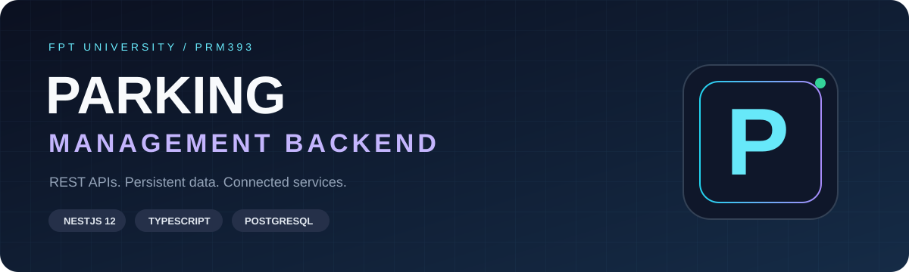
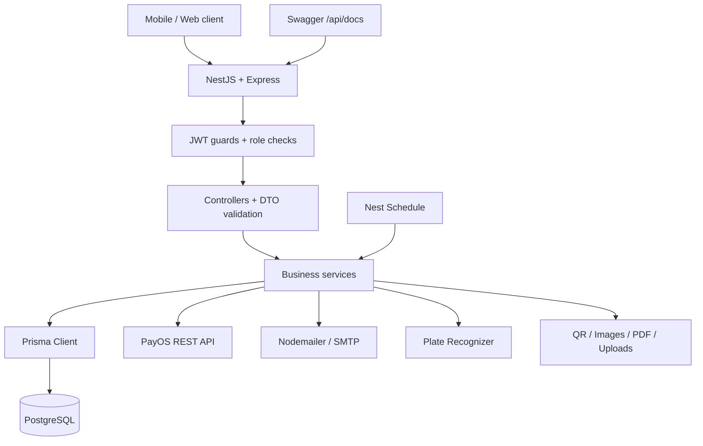

<div align="center">



# 🅿️ PRM393 · Parking Management Backend

**Backend quản lý bãi đỗ xe · REST API · PostgreSQL · Tích hợp dịch vụ**


**[Tech stack](#-tech-stack) · [Kiến trúc](#-kiến-trúc) · [Chạy local](#-chạy-local) · [Tài liệu](#-tài-liệu)**

</div>

---

## ✨ Dự án làm gì?

API backend cho hệ thống quản lý bãi xe: tài khoản, phân quyền, danh mục bãi đỗ, đặt chỗ, check-in/check-out, gói gửi xe, thanh toán, sự cố và báo cáo. Dữ liệu nghiệp vụ được truy cập qua Prisma tới PostgreSQL; Swagger là giao diện gửi request đến backend.

Repo dùng một nhóm API công khai: `/api/*` (hợp đồng PBMS). Đăng nhập tại `POST /api/Auth/login`; hồ sơ tại `GET /api/profile`. Phiên bản bên dưới lấy từ khai báo trong [package.json](package.json); phiên bản cài đặt cụ thể được khóa trong [package-lock.json](package-lock.json).

| 🔐 Identity | 🚘 Parking | 💳 Payments | 📊 Operations |
|---|---|---|---|
| JWT, roles, OTP email | Đặt chỗ, phiên gửi xe, QR | PayOS, webhook | Báo cáo PDF, sự cố, cron |

## 🧰 Tech stack

### Core & API

| Công nghệ | Phiên bản khai báo | Vai trò trong repo |
|---|---|---|
| Node.js | Runtime; hướng dẫn deploy dùng Node 22 | Chạy backend, native `fetch`, crypto và filesystem |
| TypeScript | `^6.0.2` | Kiểu dữ liệu, strict mode, NodeNext, target ES2023 |
| NestJS | `^12.0.1` | Module, controller, service, dependency injection |
| Express adapter | `@nestjs/platform-express ^12.0.1` | HTTP server, upload và static assets |
| Swagger / OpenAPI | `@nestjs/swagger ^12.0.1` | Tài liệu và gọi thử API tại `/api/docs` |
| class-validator | `^0.15.1` | Kiểm tra DTO đầu vào |
| class-transformer | `^0.5.1` | Chuyển đổi dữ liệu DTO |
| RxJS | `^7.8.1` | Observable và interceptor trong Nest |
| reflect-metadata | `^0.2.2` | Metadata cho decorators |

### Data & authentication

| Công nghệ | Phiên bản khai báo | Vai trò |
|---|---|---|
| PostgreSQL | Phiên bản server do môi trường triển khai quyết định | Database quan hệ, UUID, index, foreign key |
| Prisma CLI + Client | `6.4.1` | Schema, migration, truy vấn có kiểu và transaction |
| Passport | `^0.7.0` | Nền tảng authentication |
| Nest Passport | `^12.0.0` | Tích hợp guards/strategies |
| passport-jwt | `^4.0.1` | Xác thực JWT từ request |
| Nest JWT | `^12.0.1` | Ký và kiểm tra access/refresh token |
| bcrypt | `^6.0.0` | Hash mật khẩu và refresh token |
| Nest Config | `^12.0.0` | Cấu hình qua môi trường |

### Tích hợp & xử lý nghiệp vụ

| Thành phần | Công nghệ | Cách dùng |
|---|---|---|
| Thanh toán | PayOS REST API + native `fetch` + Node crypto | Tạo/tra cứu thanh toán, xử lý chữ ký; không dùng PayOS SDK trong dependencies |
| Email / OTP | Nodemailer `^6.10.1` + SMTP | Gửi email bằng cấu hình `MAIL_*` |
| Nhận diện biển số | Plate Recognizer Snapshot API | Upload ảnh qua HTTP, xử lý kết quả nhận diện |
| Tạo QR | qrcode `^1.5.4` | Sinh mã QR |
| Đọc QR | jsQR `^1.4.0` | Giải mã QR từ dữ liệu ảnh |
| Xử lý ảnh | sharp `^0.34.4` | Đọc/chuyển đổi ảnh phục vụ xử lý |
| Báo cáo | PDFKit `^0.17.2` | Xuất PDF |
| Job định kỳ | Nest Schedule `^12.0.0` | Cron xử lý reservation |
| Lưu file | Node filesystem + Express static assets | File upload local theo `UPLOAD_DIR` |

### Tooling, testing & hosting

| Nhóm | Công cụ |
|---|---|
| Unit / integration tests | Jest `^30.0.0`, ts-jest `^29.2.5`, `@nestjs/testing ^12.0.1` |
| HTTP tests | Supertest `^7.0.0` |
| Lint | Oxlint `^1.58.0` |
| Format | Prettier `^3.4.2` |
| Build / development | Nest CLI & Schematics `^12.0.0`, ts-node, ts-loader, tsconfig-paths, source-map-support |
| Type definitions | Node, Express, Jest, bcrypt, Multer, Nodemailer, Passport JWT, PDFKit, QRCode, Supertest |
| Package management | npm + `package-lock.json` |
| Hosting được hướng dẫn | Render Web Service + Render PostgreSQL |
| Quản trị database | pgAdmin 4 hoặc công cụ PostgreSQL tương đương; không phải dependency của app |

<details>
<summary><strong>🔎 Công cụ có trong dependencies nhưng không đồng nghĩa đã được triển khai</strong></summary>

- `@nestjs/observe ^0.1.8`: package đã khai báo; bootstrap hiện chưa thể hiện cấu hình observability riêng.
- `@nestjs/mau ^0.2.6` và `npm run deploy`: công cụ deploy có trong starter; quy trình Render của repo dùng build/start command riêng.
- Không có workflow CI trong `.github/workflows` tại thời điểm cập nhật README. Badge phía trên mô tả stack, không phải chứng nhận CI hoặc uptime.
- `@prisma/client` hiện thuộc devDependencies. Quy trình build/deploy bên dưới giữ devDependencies để runtime còn Prisma Client.

</details>

## 🏗️ Kiến trúc



Các endpoint được đánh dấu `@Public()` có thể truy cập không cần access token; các route còn lại đi qua global JWT guard. Kiểm tra quyền nghiệp vụ được áp dụng theo controller/guard tương ứng.

## 🧩 Các module

| Thư mục | Phạm vi |
|---|---|
| [`src/auth`](src/auth) | Auth PBMS (`/api/Auth`), token, OTP, mail, guards và decorators |
| [`src/users`](src/users) · [`src/roles`](src/roles) | Người dùng, hồ sơ và vai trò |
| [`src/catalog`](src/catalog) | Loại xe, tầng, cổng, chỗ đỗ, bảng giá, gói gửi xe |
| [`src/reservations`](src/reservations) | Đặt chỗ và xử lý trạng thái theo lịch |
| [`src/parking`](src/parking) | Hoạt động bãi xe và phiên gửi xe |
| [`src/subscriptions`](src/subscriptions) | Gói tháng, gia hạn và yêu cầu đổi xe |
| [`src/payments`](src/payments) | Thanh toán và webhook |
| [`src/incidents`](src/incidents) | Quản lý sự cố |
| [`src/reports`](src/reports) | Báo cáo và xuất PDF |
| [`src/integrations`](src/integrations) | PayOS, Plate Recognizer và file storage |
| [`src/prisma`](src/prisma) · [`prisma`](prisma) | Kết nối DB, schema và migration SQL |
| [`src/common`](src/common) | DTO dùng chung, interceptor, QR và xử lý biển số |

## 🚀 Chạy local

Cần Node.js phù hợp (hướng dẫn repo dùng Node 22), npm và một PostgreSQL development đã tạo. Chạy từ thư mục gốc repo.

```bash
npm ci --include=dev
```

Tạo `.env` từ [.env.example](.env.example), chỉ khi chưa có file `.env`. Điền URL database và hai JWT secret riêng; xem [hướng dẫn lấy cấu hình](docs/huong-dan-env-va-deploy.md). Dùng External Database URL nếu kết nối Render từ máy cá nhân.

```bash
npx --no-install prisma generate
```

Với **database development mới, trống** và migration đã được review, áp dụng migration được lưu trong repo:

```bash
npx --no-install prisma migrate deploy
npm run start:dev
```

Nếu database đã có bảng/dữ liệu, cần kiểm tra lịch sử migration trước khi áp dụng. Không dùng reset hoặc seed để thay thế việc kiểm tra schema. Migration tạo cấu trúc bảng; dữ liệu vận hành được nhập qua API hoặc import từ nguồn dữ liệu thật.

| URL local mặc định | Mục đích |
|---|---|
| `http://localhost:3000/` | Chuyển đến Swagger |
| `http://localhost:3000/api/docs` | Swagger UI |
| `http://localhost:3000/health` | HTTP liveness, không kiểm tra database readiness |
| `http://localhost:3000/api/Auth/*` | Auth PBMS (login, OTP, refresh, logout) |
| `http://localhost:3000/api/*` | API nghiệp vụ; xem danh sách path trong tài liệu |

<details>
<summary><strong>🔑 Các nhóm ENV cần chuẩn bị</strong></summary>

| Nhóm | Biến |
|---|---|
| Database | `DATABASE_URL` |
| JWT | `JWT_ACCESS_SECRET`, `JWT_REFRESH_SECRET` |
| Server | `NODE_ENV`, `PORT`, `CORS_ORIGIN` |
| PayOS | `PAYOS_CLIENT_ID`, `PAYOS_API_KEY`, `PAYOS_CHECKSUM_KEY`, `PAYOS_RETURN_URL`, `PAYOS_CANCEL_URL` |
| SMTP | `MAIL_HOST`, `MAIL_PORT`, `MAIL_SENDER_NAME`, `MAIL_SENDER_EMAIL`, `MAIL_PASSWORD` |
| OCR | `PLATE_RECOGNIZER_API_KEY`, `PLATE_RECOGNIZER_ENDPOINT`, `PLATE_RECOGNIZER_REGIONS`, `PLATE_RECOGNIZER_MINIMUM_CONFIDENCE` |
| Files | `UPLOAD_DIR` |

Giữ secret trong `.env` hoặc Environment của hosting. Không commit credential vào README, ảnh chụp hoặc frontend. Credential dịch vụ phải có thật để kiểm chứng email, thanh toán và OCR.

</details>

## 🧪 Development commands

```bash
npm start                 # Chạy Nest
npm run start:dev         # Watch mode
npm run start:debug       # Debug + watch
npm run build             # Biên dịch TypeScript
npm run start:prod        # Chạy bản build
npm run lint              # Oxlint
npm run format            # Format src/ và test/ bằng Prettier
npm test -- --runInBand    # Jest
npm run test:cov          # Coverage
```

HTTP smoke tests cho root, Swagger, health và global guard có thể chạy với cấu hình Jest chính:

```bash
node --experimental-vm-modules ./node_modules/jest/bin/jest.js --config ./jest.config.ts --testRegex 'app.e2e-spec.ts$' --runInBand
```

Script `test:e2e` riêng cũng có trong `package.json`; nó dùng `test/jest-e2e.json`. Lệnh trên tái sử dụng cấu hình transform TypeScript của repo. Test dùng mocks không chứng minh dịch vụ hosted đã hoạt động; cần kiểm chứng luồng thực trên môi trường phù hợp.

## ☁️ Deployment

Render chạy backend và Swagger trong cùng một Web Service. PostgreSQL là tài nguyên riêng, được kết nối qua `DATABASE_URL`.

| Cấu hình Web Service | Giá trị |
|---|---|
| Build | `npm ci --include=dev && npx --no-install prisma generate && npm run build` |
| Pre-deploy, khi gói hỗ trợ và migration đã review | `npx --no-install prisma migrate deploy` |
| Start | `npm run start:prod` |
| Health Check Path | `/health` |
| Database | Internal URL nếu backend và DB Render cùng region |

Chi tiết trong [hướng dẫn deployment](docs/huong-dan-env-va-deploy.md), [setup health check](docs/render-health-check.md) và [uptime Render Free](docs/render-uptime.md). Không chạy `migrate dev`, reset hoặc seed tự động trong startup production.

<details>
<summary><strong>📌 Phạm vi vận hành hiện tại</strong></summary>

- OTP đang lưu trong memory của process, mất khi restart và chưa chia sẻ giữa nhiều instance.
- Upload dùng filesystem; cần persistent storage nếu muốn giữ file sau redeploy.
- Cron chạy trong process ứng dụng; cần đánh giá điều phối khi chạy nhiều instance.
- Health 200 chỉ xác nhận HTTP liveness. Kiểm tra database bằng API và đối chiếu bản ghi thực.
- Có code tích hợp không đồng nghĩa tài khoản nhà cung cấp, webhook và quyền truy cập mạng đã được cấu hình trên hosting.
- Một số tài liệu trong `docs/` là bản kế hoạch/snapshot trước đó. Khi trạng thái khác nhau, đối chiếu source, schema và migration hiện tại.

</details>

## 📚 Tài liệu

| Tài liệu | Nội dung |
|---|---|
| [ENV & deployment](docs/huong-dan-env-va-deploy.md) | Lấy credential, host API/DB và kiểm chứng dữ liệu thật |
| [Render health check](docs/render-health-check.md) | Root redirect, Swagger, health và dashboard settings |
| [Render uptime (Free)](docs/render-uptime.md) | Sleep khi idle, cold start, ping `/health` từ cron bên ngoài |
| [PBMS API paths](docs/openapi-pbms-paths.md) | Hợp đồng route PBMS |
| [Prisma review](docs/prisma-draft-review.md) | Bối cảnh thiết kế schema |
| [Third-party follow-up](docs/third-party-follow-up.md) | Kế hoạch tích hợp và chuyển đổi từ hệ thống cũ |

---

<div align="center">

**PRM393 · FPT University · Backend Engineering · fogit **


Licensed under the [MIT License](LICENSE).

</div>
