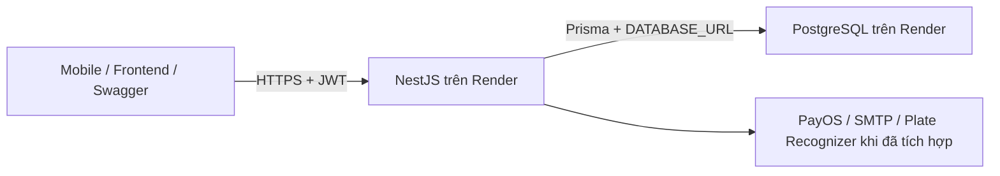

# Hướng dẫn điền ENV và host backend, Swagger, PostgreSQL thật

Đối chiếu repo và tài liệu nhà cung cấp ngày 17/09/2026. Tài liệu này hướng dẫn thao tác; chưa tạo tài khoản cloud, mua dịch vụ, chạy migration hoặc triển khai ứng dụng.

## 1. Kết quả cần đạt

Bạn sẽ có backend HTTPS, Swagger trên chính backend đó, và PostgreSQL hosted lưu dữ liệu bền vững. Không cần host Swagger thành một website riêng.



Ví dụ địa chỉ minh họa, phải thay bằng địa chỉ được cấp:

- Backend: `https://prm393-api.onrender.com`
- Swagger: `https://prm393-api.onrender.com/api/docs`
- Đăng ký: `POST https://prm393-api.onrender.com/api/Auth/send-register-otp` rồi `POST .../api/Auth/verify-register-otp`
- Đăng nhập: `POST https://prm393-api.onrender.com/api/Auth/login`
- Hồ sơ: `GET https://prm393-api.onrender.com/api/profile`

Swagger gửi request thật đến API. Dữ liệu chỉ là mock nếu code API tự trả dữ liệu giả. `AuthService` hiện gọi Prisma để tạo/tìm user và lưu refresh session trong PostgreSQL.

**Database mới ban đầu trống là bình thường.** Migration tạo bảng và ràng buộc; seed chèn dữ liệu mẫu; hai việc khác nhau. Để có dữ liệu nghiệp vụ thật, người dùng nhập qua API đã triển khai, hoặc chuyển dữ liệu thực từ hệ thống cũ. Host database không tự sinh dữ liệu.

## 2. Trạng thái repo cần biết trước khi deploy

| Hạng mục | Hiện trạng lúc viết tài liệu |
|---|---|
| Backend | NestJS 12, Prisma 6.4.1, PostgreSQL |
| Route hoạt động trong source | Auth `/api/Auth/*`; hồ sơ `/api/profile`; Swagger `/api/docs` |
| Các route PBMS `/api/*` | Là mục tiêu trong tài liệu; chưa có controller được đăng ký cho các module này |
| Prisma schema | Đã mở rộng các model nghiệp vụ; có model không đồng nghĩa đã có API |
| Migration | Chưa có thư mục migration đã lưu; cần tạo và review trước deploy |
| ENV đang được đọc | `DATABASE_URL`, `JWT_ACCESS_SECRET`, `JWT_REFRESH_SECRET`, `NODE_ENV`, `PORT` |
| CORS, PayOS, SMTP, Plate Recognizer, upload | Có biến mẫu/kế hoạch nhưng chưa có tích hợp trong source hiện tại |
| Prisma Client | Đang ở devDependencies; phải giữ nó trong môi trường runtime hoặc chuyển đúng sang dependencies |
| JWT secret | Code vẫn có fallback hardcoded; cần bỏ fallback và kiểm tra biến bắt buộc trước khi vận hành production thực tế |

Vì vậy, có thể chuẩn bị hạ tầng và kiểm chứng auth với database thật. Chưa thể tuyên bố toàn bộ hệ thống bãi xe/payments/OTP sẵn sàng chỉ bằng cách điền ENV.

## 3. Lựa chọn hosting

Hướng dẫn chính: **Render Web Service + Render PostgreSQL cùng region**. Chọn gói trả phí phù hợp nếu cần lưu dữ liệu lâu dài và gửi Gmail SMTP. Xem chi phí thực tế trong dashboard trước khi tạo; tài liệu này không chốt giá hay tự đăng ký gói.

Render Free có giới hạn liên quan trực tiếp: Postgres hết hạn sau 30 ngày; web service có thể ngủ khi không hoạt động, không có persistent disk và chặn outbound SMTP trên các port 25/465/587. Vì vậy không dùng cấu hình Free như giải pháp lâu dài cho dữ liệu thật và OTP Gmail. [Giới hạn chính thức](https://render.com/docs/free)

Chuẩn bị tài khoản GitHub, Render, quyền truy cập repository, và tài khoản các nhà cung cấp nếu cần chức năng tích hợp. Chỉ đưa credential vào `.env` local hoặc Environment của hosting; không commit vào GitHub và không đưa vào frontend/mobile.

## 4. Tạo PostgreSQL hosted và lấy DATABASE_URL

1. Vào [Render Dashboard](https://dashboard.render.com/), chọn **New → Postgres**.
2. Đặt tên tài nguyên, ví dụ `prm393-postgres-prod`; tên database có thể là `prm393_db`.
3. Chọn region sẽ dùng cho backend, ưu tiên gần người dùng. Chọn gói lưu trữ phù hợp.
4. Tạo database, đợi trạng thái Available, mở **Connect**.
5. Copy **Internal Database URL** để dùng cho backend Render cùng tài khoản/region.
6. Copy **External Database URL** để dùng từ máy cá nhân: công cụ quản trị, migration có chủ đích, kiểm tra dữ liệu.
7. Giữ các tùy chọn SSL của nhà cung cấp. Với external URL, dùng TLS; có thể thêm `sslmode=require` nếu chưa có. Nếu URL đã có `?`, thêm tham số bằng `&`.

Không đoán hostname/password. Internal URL không phải địa chỉ dùng được từ laptop. Hạn chế external access về IP cần thiết trong phần Networking. [Tạo và kết nối Render Postgres](https://render.com/docs/postgresql-creating-connecting)

Hình dạng URL minh họa:

```dotenv
DATABASE_URL="postgresql://DB_USER:DB_PASSWORD@DB_HOST:5432/DB_NAME?schema=public&sslmode=require"
```

Trên Render Environment, nhập giá trị URL **không kèm dấu nháy bao ngoài**. Trong `.env`, dấu nháy như ví dụ trên hợp lệ. Nếu tự ghép URL, encode ký tự đặc biệt trong user/password; tốt nhất dùng nguyên connection string được cấp.

Tạo một database development riêng khi phát triển. Không để các lệnh test, reset hoặc thử schema trên máy cá nhân trỏ nhầm database production.

## 5. Lấy và điền từng biến môi trường

### 5.1. Backend và JWT

| Biến | Local | Render |
|---|---|---|
| `NODE_ENV` | `development` | `production` |
| `PORT` | `3000` | Để Render cấp port; app đọc `process.env.PORT` |
| `DATABASE_URL` | External URL của DB development | Internal URL của DB production |
| `JWT_ACCESS_SECRET` | Secret riêng cho local/dev | Secret riêng production |
| `JWT_REFRESH_SECRET` | Secret khác access secret | Secret khác access secret và khác dev |

Tạo mỗi secret bằng lệnh sau trong terminal, chạy **hai lần**:

```powershell
node -e "console.log(require('node:crypto').randomBytes(48).toString('hex'))"
```

Copy mỗi kết quả vào đúng biến trong `.env` hoặc Render. Không dùng chuỗi `REPLACE_WITH_*`. Không đổi secret mỗi lần restart/deploy vì token đã phát sẽ bị ảnh hưởng. Hai secret này tự sinh, không lấy từ GitHub, Google hay PayOS.

### 5.2. CORS và địa chỉ frontend

`CORS_ORIGIN` là origin của **frontend web**, ví dụ `https://parking.example.com`, không phải URL Swagger hay PostgreSQL. Local Vite dùng `http://localhost:5173`.

Repo chưa gọi `app.enableCors()`, nên điền biến chưa bật CORS. Khi triển khai frontend khác origin phải nối cấu hình này vào Nest, khai báo origin được phép. Swagger trên cùng domain backend không cần CORS xuyên domain. Ứng dụng mobile native không bị CORS của trình duyệt; WebView có thể khác.

### 5.3. PayOS

1. Vào [payOS](https://payos.vn/), đăng ký/đăng nhập tài khoản merchant.
2. Hoàn thành các bước tài khoản/ngân hàng mà dashboard yêu cầu và tạo/chọn kênh thanh toán cho dự án.
3. Trong thông tin tích hợp của kênh, lấy **Client ID**, **API Key**, **Checksum Key** và map đúng tên bên dưới. Nếu dashboard thay đổi vị trí, theo tài liệu tích hợp của kênh.

| PayOS | ENV |
|---|---|
| Client ID | `PAYOS_CLIENT_ID` |
| API Key | `PAYOS_API_KEY` |
| Checksum Key | `PAYOS_CHECKSUM_KEY` |
| Trang frontend báo kết quả | `PAYOS_RETURN_URL=https://FRONTEND/payment-success` |
| Trang frontend khi hủy | `PAYOS_CANCEL_URL=https://FRONTEND/payment-cancel` |

Các URL return/cancel do bạn triển khai, không phải secret PayOS cấp. Sau khi module backend hoàn thành, cấu hình webhook HTTPS dự kiến `https://BACKEND/api/payments/payos-webhook`. Route hiện chưa được triển khai; chưa đăng ký webhook vào một URL trả 404. Backend phải kiểm tra chữ ký và đối chiếu giao dịch, không đánh dấu đã thanh toán chỉ vì trình duyệt mở trang success. [SDK Node](https://payos.vn/docs/sdks/back-end/node/), [API/webhook](https://payos.vn/docs/api/)

### 5.4. Gmail SMTP cho OTP/email

1. Chọn tài khoản email thực dùng để gửi mail dự án.
2. Trong Google Account → Security, bật **2-Step Verification**.
3. Mở [App passwords](https://myaccount.google.com/apppasswords), tạo mật khẩu ứng dụng, đặt tên để nhận biết backend.
4. Copy mật khẩu ứng dụng vào `MAIL_PASSWORD`; không dùng mật khẩu đăng nhập Google.
5. Nếu không có mục App passwords, kiểm tra loại tài khoản/chính sách quản trị theo [Google Help](https://support.google.com/accounts/answer/185833?hl=en). Không phải mọi tài khoản đều cho phép.

```dotenv
MAIL_HOST="smtp.gmail.com"
MAIL_PORT=587
MAIL_SENDER_NAME="PRM393 Parking Management"
MAIL_SENDER_EMAIL="DIA_CHI_GMAIL_THAT_CUA_BAN"
MAIL_PASSWORD="APP_PASSWORD_VUA_TAO"
```

Khi implement transport, port 587 dùng STARTTLS. Sau triển khai hãy gửi OTP tới hộp thư bạn kiểm soát và kiểm tra nhận được thư, không chỉ nhìn log. Render Free chặn port này; điền đúng mật khẩu vẫn không giải quyết giới hạn mạng. Nếu giữ Gmail SMTP, dùng hosting/gói hỗ trợ SMTP; chuyển sang email API là thay đổi tích hợp riêng. Module gửi mail hiện chưa có.

### 5.5. Plate Recognizer

1. Đăng ký/đăng nhập [Snapshot Cloud dashboard](https://app.platerecognizer.com/).
2. Lấy API token của tài khoản, kiểm tra gói/quota sử dụng.
3. Điền token vào `PLATE_RECOGNIZER_API_KEY`.
4. Giữ endpoint/region của kế hoạch; khi implement kiểm tra lại endpoint và cách xác thực theo [Snapshot API](https://guides.platerecognizer.com/docs/snapshot/api-reference/).

```dotenv
PLATE_RECOGNIZER_API_KEY="TOKEN_CUA_BAN"
PLATE_RECOGNIZER_ENDPOINT="https://api.platerecognizer.com/v1/plate-reader/"
PLATE_RECOGNIZER_REGIONS="vn"
PLATE_RECOGNIZER_MINIMUM_CONFIDENCE=0.75
```

Ngưỡng 0.75 là lựa chọn lọc kết quả phía app, không phải credential được cấp. Kiểm chứng bằng ảnh thực bạn được phép sử dụng sau khi module nhận diện đã triển khai; không ghi token vào response hoặc ứng dụng mobile.

### 5.6. Upload ảnh

Local dùng `UPLOAD_DIR=./public/uploads`. Biến này không phải URL public và không phải storage cloud được cấp sẵn.

Trên hosting, filesystem thông thường không bảo đảm giữ file sau redeploy. Để giữ ảnh thật, chọn persistent disk và đặt đường dẫn mount vào `UPLOAD_DIR` sau khi nối cấu hình vào code, hoặc triển khai object storage. Metadata trong PostgreSQL không giữ thay nội dung file ảnh. Static serving, quyền đọc file, giới hạn upload và URL trả cho client vẫn cần implement. [Persistent disks](https://render.com/docs/disks)

## 6. Chuẩn bị schema mà không seed dữ liệu

Chưa có migration trong repo lúc viết tài liệu. Không đặt `prisma migrate deploy` rồi cho rằng lệnh tự biến schema thành bảng nếu chưa có migration SQL.

### Database mới, hoàn toàn trống

Sau khi schema hiện tại đã được review, tạo migration SQL ban đầu bằng Prisma **6.4.1 đang cài**. Chạy từ root repo, chỉ khi `prisma/migrations/0_init` chưa tồn tại:

```powershell
npm ci --include=dev
npx --no-install prisma validate
New-Item -ItemType Directory -Path prisma/migrations/0_init
npx --no-install prisma migrate diff --from-empty --to-schema-datamodel prisma/schema.prisma --script --output prisma/migrations/0_init/migration.sql
```

`validate` cần `DATABASE_URL` hợp lệ trong `.env`/môi trường. Lệnh diff trên tạo SQL từ schema, không áp dụng vào database. Tham số đã được đối chiếu với CLI 6.4.1 trong repo. Tạo `prisma/migrations/migration_lock.toml` với nội dung:

```toml
provider = "postgresql"
```

Đọc SQL: xác nhận model/ràng buộc mong muốn, không có lệnh chèn dữ liệu mẫu. Commit migration và lock file cùng schema sau review. Từ đó deployment áp dụng migration đã lưu bằng `prisma migrate deploy`. Không dùng `db seed`, `migrate reset` hay `db push --accept-data-loss` để triển khai dữ liệu thật.

Đây là hướng dẫn tạo migration, tài liệu này **không tạo hoặc thực thi migration**. Schema PBMS đang thay đổi nên cần review bản cuối trước khi chạy.

### Database đã có dữ liệu

Không dùng quy trình `from-empty` rồi apply lên database đang có bảng. Cần backup, đối chiếu schema và thiết lập baseline/migration thích hợp trước.

Nếu dữ liệu thật nằm trong SQL Server của hệ thống PBMS:

1. Lấy bản export/backup được phép truy cập từ chủ hệ thống.
2. Chốt mapping bảng, khóa, enum/string trạng thái, thời gian và quan hệ sang PostgreSQL.
3. Viết quy trình ETL/import chạy thử trên database riêng, kiểm tra số lượng và khóa ngoại.
4. Kiểm tra tương thích password hash; không mặc định hash PBMS dùng được với bcrypt Nest. Có thể cần luồng reset mật khẩu. Không chuyển refresh token plaintext cũ thành phiên Nest đang hoạt động.
5. Đối soát dữ liệu thực, rồi mới chuyển đổi production theo kế hoạch backup/cutover.

File `.bak` SQL Server không thể restore trực tiếp bằng công cụ PostgreSQL. Đây là migration dữ liệu thực, không phải seed. Nếu chưa có dữ liệu cũ, bắt đầu trống rồi nhập nghiệp vụ thật qua các API đã hoàn thiện.

## 7. Deploy backend và Swagger trên Render

### Chuẩn bị source

- Đảm bảo code/schema/migration cần dùng đã có trên branch GitHub được deploy; không commit `.env`.
- Chạy lint/build và test liên quan trước khi phát hành. Generated Prisma Client phải khớp schema mới.
- Đặt Node major cố định đã kiểm thử, ví dụ Node 22 qua `NODE_VERSION=22` trên Render; đây là biến của nền tảng, không phải biến ứng dụng trong `.env.example`. Kiểm tra build sạch với phiên bản đó. [Node version trên Render](https://render.com/docs/node-version)
- Bỏ JWT fallback hardcoded và kiểm tra secret bắt buộc trước khi dùng production thực tế; việc đó chưa được tài liệu này sửa code.

### Tạo Web Service

1. Render → **New → Web Service**, kết nối GitHub và chọn repo/branch.
2. Chọn runtime Node, cùng region với PostgreSQL. Root Directory là thư mục có `package.json` (để trống nếu repo root).
3. Chọn gói phù hợp, thêm ENV ở bước dưới.
4. Build Command:

```sh
npm ci --include=dev && npx --no-install prisma generate && npm run build
```

5. Pre-Deploy Command, sau khi đã commit/review migration:

```sh
npx --no-install prisma migrate deploy
```

6. Start Command:

```sh
npm run start:prod
```

Quy trình này giữ devDependencies vì repo hiện để Prisma Client và CLI ở đó; không thêm `npm prune --omit=dev`. Khi tối ưu runtime, chuyển `@prisma/client` sang dependencies và cập nhật lockfile trước. Nếu gói không hỗ trợ pre-deploy, chạy migration bằng một release job/môi trường quản trị có URL đúng trước khi đưa app mới vào phục vụ; không thay bằng reset database. [Render deploy lifecycle](https://render.com/docs/deploys)

### Environment trong dashboard

Điền tối thiểu `NODE_ENV=production`, Internal `DATABASE_URL`, hai JWT secret thật và Node version đã chọn. Render cung cấp `PORT`. Không upload nguyên `.env` dev có localhost rồi hy vọng cloud kết nối đúng database.

Các credential PayOS/mail/OCR có thể chuẩn bị theo mục 5, nhưng chỉ cần hoạt động khi module tương ứng đã implement. Tên biến phải khớp code; không có cơ chế tự tích hợp dịch vụ chỉ nhờ biến ENV.

Render yêu cầu web server lắng nghe trên `0.0.0.0` và port được cấp; khi cần sửa cấu hình bind, dùng `app.listen(port, '0.0.0.0')`. Repo đã đọc `PORT`. Đặt Health Check Path `/health` (`GET` công khai, JSON `{"status":"ok"}`, không cần JWT, không truy vấn database). `GET /` công khai, redirect sang `/api/docs`. Gói Free vẫn ngủ khi idle; không dùng health check nội bộ Render để “giữ 24/7”. Xem `docs/render-uptime.md`. [Web services](https://render.com/docs/web-services)

### Sau deploy

Đợi build/migration/start thành công; mở URL service rồi `/api/docs`. Kiểm tra log Prisma kết nối thành công và không có lỗi thiếu bảng. Swagger UI mở được chỉ chứng minh HTTP phục vụ được giao diện, chưa chứng minh API đọc/ghi database thành công.

Không cần `npm run deploy` cho quy trình Render này; Render chạy các command đã cấu hình. HTTPS dùng domain hosting được cấp; custom domain là bước tùy chọn sau.

## 8. Chứng minh API dùng database thật

Thực hiện bằng tài khoản/email bạn thực sự muốn đăng ký, không dùng dữ liệu example mặc định của Swagger.

1. Mở **Swagger production** `/api/docs`, chọn `POST /api/Auth/send-register-otp` → Try it out, rồi `POST /api/Auth/verify-register-otp`.
2. Điền các trường theo DTO PBMS (`userName`, `fullName`, `email`, `phoneNumber`, `password`, OTP). Password theo yêu cầu DTO; không gửi thêm role hoặc trường không thuộc DTO.
3. Execute, kiểm tra envelope `{ statusCode, message, isSuccess, result }` và ghi nhận `userId` khi đăng ký thành công. Response token được phát từ backend thật; không chia sẻ token.
4. Dùng nút **Authorize**, dán raw `accessToken` (trong `result`) vào scheme `JWT-auth`, không gõ thêm `Bearer` nếu Swagger tự thêm.
5. Gọi `GET /api/profile`. Email/id phải trùng tài khoản vừa tạo.
6. Từ công cụ quản trị như pgAdmin/DBeaver kết nối External URL đúng DB production, chạy truy vấn chỉ đọc sau và thay email bằng email vừa dùng:

```sql
SELECT id, email, first_name, last_name, created_at
FROM public.users
WHERE email = 'EMAIL_BAN_VUA_DANG_KY';
```

7. Kiểm tra id bằng response API. Không cần SELECT password_hash/token_hash để xác nhận persistence.
8. Restart backend từ dashboard, sau đó `POST /api/Auth/login` bằng tài khoản cũ, lấy token mới và gọi `GET /api/profile`. User phải còn, không đăng ký lại.
9. Kiểm tra deployment không chạy seed/reset và URL database không thay đổi sau mỗi deploy.

Kết quả đạt: thao tác người dùng ghi vào PostgreSQL hosted, SQL đọc được cùng bản ghi, và dữ liệu tồn tại sau restart. Đối với bãi xe, chỗ đỗ, đặt chỗ và thanh toán, lặp lại cách kiểm tra khi endpoint nghiệp vụ đã có; không coi các model Prisma là endpoint đã triển khai.

Đăng ký auth hiện tại chưa gửi email xác minh. API trả thành công không chứng minh SMTP/OTP đã hoạt động. Tương tự, thanh toán thật phải có giao dịch được nhà cung cấp xác minh, không chỉ một dòng tạo tay trong bảng payments.

## 9. Backup, file ảnh và các lỗi hay gặp

Bật/kiểm tra chính sách backup của gói database, ghi rõ thời gian giữ bản sao và thử restore vào database riêng trước khi dựa vào backup. Redeploy app không thay thế backup DB. Nếu có ảnh, backup storage ảnh riêng. [Render Postgres backups](https://render.com/docs/postgresql-backups)

| Hiện tượng | Kiểm tra |
|---|---|
| Prisma P1001 / không kết nối được | Host/region, internal so với external URL, trạng thái DB, IP allowlist, TLS |
| Prisma P1000 | Username/password và URL encoding; credential có bị rotate không |
| Prisma P2021 / bảng không tồn tại | Migration đã commit, đã chạy đúng DB, đúng schema chưa |
| Build thiếu `@prisma/client` hoặc kiểu Prisma | Cài devDependencies theo repo hiện tại và chạy generate trước build |
| Swagger 200 nhưng API 500 | Kiểm tra query DB/migration/log; Swagger không kiểm tra DB thay bạn |
| `/api/profile` 401 | Access token đúng môi trường, còn hạn, đã Authorize chưa |
| Register 400 | DTO OTP đủ trường, password đúng yêu cầu, không có trường dư |
| Register 409 / conflict trong envelope | Email đã tồn tại thật; đăng nhập thay vì chèn lại |
| Route `/auth/login` 404 | Surface Nest `/auth/*` đã gỡ; dùng `/api/Auth/login` |
| Web frontend bị CORS | Code chưa nối CORS_ORIGIN, origin không khớp; không phải lỗi password DB |
| SMTP timeout trên Free | Giới hạn outbound SMTP, không phải chỉ do App Password |
| Dữ liệu mất sau redeploy | DB URL trỏ nhầm DB, DB hết hạn/reset, hoặc dữ liệu chỉ nằm trong memory |
| Ảnh mất nhưng bản ghi còn | Filesystem không persistent; cần storage bền vững |

## 10. Thứ tự thực hiện

1. Tạo database hosted và lấy đúng internal/external URL.
2. Tạo JWT secret, chuẩn bị Environment của backend.
3. Review schema và lưu migration SQL; không seed.
4. Hoàn thiện các điểm cấu hình production trong code và kiểm tra build.
5. Deploy backend, apply migration có chủ đích, mở Swagger.
6. Đăng ký/đăng nhập bằng thông tin thật và đối chiếu bản ghi SQL sau restart.
7. Hoàn thiện API nghiệp vụ, nhập dữ liệu vận hành thật hoặc migrate dữ liệu cũ.
8. Tích hợp và kiểm chứng PayOS, email, OCR, storage; xác nhận backup trước khi vận hành lâu dài.

Xem thêm [file ENV mẫu](../.env.example) và [kế hoạch third-party/PBMS](third-party-follow-up.md). Không cần gửi secret qua chat để làm theo tài liệu; điền trực tiếp vào dashboard hoặc `.env` của bạn.
